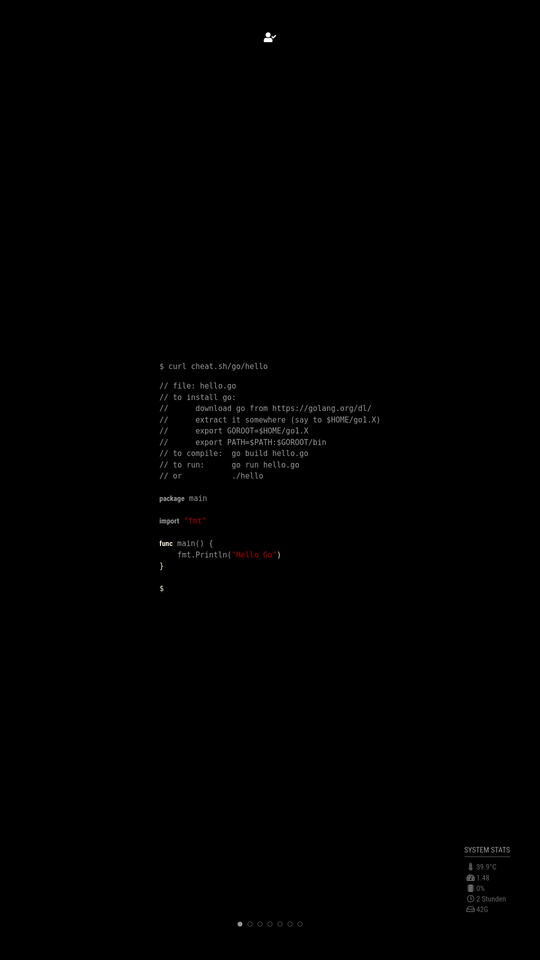

# MMM-FF-cht-sh

[](https://choosealicense.com/licenses/isc)

A module for [MagicMirror²](https://github.com/MichMich/MagicMirror) presenting your most treasured [cheat sheets](https://cht.sh).

Features:

- sequences
- randomness
- events for user interactions
- supports multiple module instances
- supports multiple mirror instances, controlled by a single server

## Installation

Navigate to the `modules` directory of your MagicMirror² installation and clone this repository.

```sh
git clone https://github.com/shin10/MMM-FF-cht-sh.git
$(
  cd MMM-FF-cht-sh &&
  npm i
)
```

## Configuration

**Example:**

```js
{
  module: "MMM-FF-cht-sh",
  position: "fullscreen_above",
  header: "cht.sh",
  config: {
    baseURL: "https://cht.sh/",
    sheets: [
      // some special pages
      { path: ":firstpage" },
      { path: ":firstpage-v1" },
      { path: ":random", style: "default", weight: 10 },
      { path: ":help", options: "T" },
      { path: ":styles-demo" },

      // some examples
      { path: "bash/:learn" },
      { path: "bash/shortcuts" },
      { path: "bash/forkbomb" },
      { path: "awk" },
      { path: "git/:learn" },
      { path: "tmux" },
      { path: "fzf" },
      { path: "go/hello" },

      // all sources or a specific one
      { path: "tar" },
      { path: "cheat.sheets:tar" },
      { path: "cheat:tar" },
      { path: "tldr:tar" }
    ],
    options: null,
    style: ["default", "monokai"],
    sequence: null,
    updateOnSuspension: null,
    updateInterval: 1 * 60 * 1000,
    showTitle: false,
    scrollAmount: 1600,
    animationSpeed: 1000,
    loadingCursor: " _",
    events: {
      CHEAT_SHEET_SCROLL_UP: "CHEAT_SHEET_SCROLL_UP",
      CHEAT_SHEET_SCROLL_DOWN: "CHEAT_SHEET_SCROLL_DOWN",
      ARTICLE_PREVIOUS: "CHEAT_SHEET_LIST_ITEM_PREVIOUS",
      ARTICLE_NEXT: "CHEAT_SHEET_LIST_ITEM_NEXT",
      ARTICLE_RANDOM: "CHEAT_SHEET_LIST_ITEM_RANDOM",
    }
  }
},
```

### Configuration Options

| **Option**           | **Type**         | **Default**           | **Description**                                                                                                                                                                 |
| -------------------- | ---------------- | --------------------- | ------------------------------------------------------------------------------------------------------------------------------------------------------------------------------- |
| `header`             | `string`         | `"cht.sh"`            | Basically that. Doesn't have to be changed unless you're self-hosting.                                                                                                          |
| `baseURL`            | `string`         | `"https://cht.sh/"`   | Basically that. Doesn't have to be changed unless you're self-hosting.                                                                                                          |
| `sheets`             | `Array<sheet>`   |                       | The list of cheat sheets to rotate through.                                                                                                                                     |
| `options`            | `string`         | `null`                | The url options `qTcCQ` as described [here](https://cht.sh/:help).                                                                                                              |
| `style`              | `string`         | `"default"`           | Your favorite color theme. You can provide a string, `:random`, or an Array of themes. [Demo](https://cht.sh/:styles-demo) (probably outdated)                                  |
| `sequence`           | `string`         | `"default"`           | The direction to loop through the urls list. `null`/`default`, `reverse`, `random`. The `weight` property of an url item will only be respected if sequence is set to `random`. |
| `updateInterval`     | `int`            | `600000` (10 minutes) | The duration of the update interval in ms or `null`.                                                                                                                            |
| `updateOnSuspension` | `bool`           | `null`                | `null`, `false` or `true`. Further explanations below.                                                                                                                          |
| `showTitle`          | `bool`           | `true`                | A boolean to show/hide the title.                                                                                                                                               |
| `loadingCursor`      | `string`         | `"&nbsp;&block;"`     | The Text cursor indicating that the module is loading a cheat sheet. Default is `&nbsp;&block;` but could be any string.                                                        |
| `scrollAmount`       | `string`         | `null`                | The amount of pixels to scroll up/down if the page is too long. Scrolling is controlled through the events listed beneath.                                                      |
| `animationSpeed`     | `int`            | `1000`                | The duration of the page transition.                                                                                                                                            |
| `events`             | `object`         |                       | An object listing event constants to remap if necessary.                                                                                                                        |
| `events.sender`      | `string`/`array` | `null`                | If this is set, only events sent by the modules with this id will be processed.                                                                                                 |

### Sheet list items

The items in the sheet list need a path. All other properties are optional. The `weight` property will be used if the `CHEAT_SHEET_LIST_ITEM_RANDOM` event is dispatched, or sequence is set to `random`. Options and styles can be set to override the defaults for single items.

```js
{
  path: ":random",
  options: "qTcCQ",
  style: "lovelace",
  weight: 10
}
```

### `updateInterval` and `updateOnSuspension`

These two parameters work together. The `updateInterval` is used to set the **_minimal_** amount of time the displayed item has to exist, before it will be replaced by the next. When this actually will take place depends on the value of `updateOnSuspension`.

If `updateOnSuspension` is set to `true` the item will wait till the interval timer fired and the module goes to the background. If set to `false` the `updateInterval` has to elapse while the item is in background and will replace the item when the module is shown again.

If `updateOnSuspension` is set to `null` the content will be replaced whenever the timer is done; visible or not.

If `updateInterval` is set to `null` the item won't be updated by the module. Instead you'll have to dispatch one of the events listed above.

### Events

The following events are supported:

- CHEAT_SHEET_SCROLL_UP
- CHEAT_SHEET_SCROLL_DOWN
- CHEAT_SHEET_LIST_ITEM_PREVIOUS
- CHEAT_SHEET_LIST_ITEM_NEXT
- CHEAT_SHEET_LIST_ITEM_RANDOM

For ease of use they can be remapped in the `events` object to custom strings. Refer to the example config above.

Events will be ignored if the module is currently hidden.

[&pi;](https://www.youtube.com/watch?v=dQw4w9WgXcQ)
